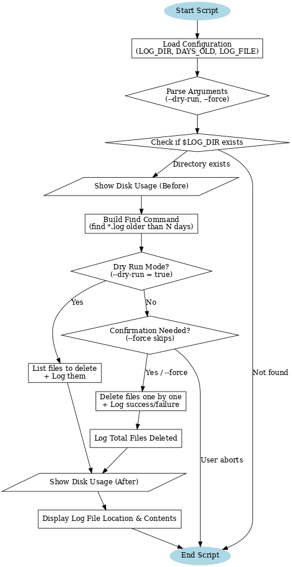

# 🧩 Shell Scripting Project Series  
## 🧹Project 1: Log Cleaner

Automate cleanup of old log files before disk crashes.  
Inspired by real-world incidents where servers ran out of space due to unchecked logs.

🎥 Watch the full walkthrough on YouTube → [Project 1: Log Cleaner Video](https://youtube.com/yourvideo)

---

## ⚙️ Features
- Safe cleanup of logs older than a defined number of days
- Dry-run mode for testing without deleting files
- Disk usage summary before and after cleanup
- Logging of all cleanup actions with timestamps
- User confirmation before deletion
- Automation-ready (cron compatible)

---

## 🧠 Learnings from this Project
- Working with conditional logic (`if`, `else`)
- Using commands like `find`, `df`, `rm`
- Implementing dry-run vs real-run logic
- Handling user input and safety confirmations
- Logging and timestamping events
- Automating tasks with cron jobs
- Writing production-safe shell scripts

---

## Log Cleaner Script Flowchart


### Flowchart Summary
The flowchart above visually represents the script logic — starting from configuration loading and argument parsing, validating the log directory, and then branching into dry-run or real execution modes. It ensures safe cleanup, detailed logging, and automated scheduling through cron.

## 🧰 Prerequisites
- AWS CLI installed
- Access to AWS account with IAM permissions
- Ubuntu 22.04 EC2 instance
- Basic Linux command-line knowledge

---

## 📘 Table of Contents
1. [Step 1: Install AWS CLI](#step-1-install-aws-cli)
2. [Step 2: Create an IAM User with CLI Credentials](#step-2-create-an-iam-user-with-cli-credentials)
3. [Step 3: Configure AWS CLI](#step-3-configure-aws-cli)
4. [Step 4: Verify Authentication](#step-4-verify-authentication)
5. [Step 5: Run `create_ubuntu_ec2.sh`](#step-5-run-create_ubuntu_ec2sh)
6. [Step 6: Run and Understand `log_cleaner.sh`](#step-6-run-and-understand-log_cleanersh)
7. [Step 7: Automate with Cron (Daily Log Files)](#step-7-automate-with-cron-daily-log-files)
---

## Step 1: Install AWS CLI
Follow AWS official docs: https://docs.aws.amazon.com/cli/latest/userguide/install-cliv2.html

Verify installation:
aws --version

Expected output:
aws-cli/2.15.X Python/3.X.X Windows/10 exe/AMD64

---

## Step 2: Create an IAM User with CLI Credentials
1. Log into AWS Console as Root user
2. Navigate to: IAM → Users → Add users
3. Enter a username (example: devops-admin)
4. Leave the “Provide user access to the AWS Management Console” unchecked 
   (you don’t need console login) and Click Next..
4. On Permissions step → Attach policies directly → select AdministratorAccess
5. Finish creating the user
6. Go to the user’s Security credentials tab
7. Under Access keys → Create access key
8. Choose “Command Line Interface (CLI)” as the use case
9. Copy Access Key ID and Secret Access Key (download the .csv file)

---

## Step 3: Configure AWS CLI

Run: aws configure

Fill in:

AWS Access Key ID [None]: Paste your Access Key ID  
AWS Secret Access Key [None]: Paste your Secret Access Key  
Default region name [None]: us-east-1  
Default output format [None]: json  

This saves credentials into: ~/.aws/credentials

---

## Step 4: Verify Authentication
Run:
aws sts get-caller-identity

Expected output:
{
    "UserId": "AIDAEXAMPLE12345",
    "Account": "123456789012",
    "Arn": "arn:aws:iam::123456789012:user/devops-admin"
}

✅ If you see your account number and IAM username, authentication is successful.

---

## Step 5: Run `create_ubuntu_ec2.sh`

Clone or download this project to your local machine. If you are on Windows using Git Bash, convert Windows line endings and make the script executable:

dos2unix create_ubuntu_ec2.sh  
chmod +x create_ubuntu_ec2.sh

Now run the script:

./create_ubuntu_ec2.sh

The script will:  
- ✅ Check if the key pair exists, or create a new one (`my-key-pair.pem`)  
- ✅ Check if the security group exists, or create one (`my-sg`) and allow SSH from your IP  
- ✅ Launch a new **Ubuntu 22.04 EC2 instance (t3.micro, free tier eligible)**  
- ✅ Wait until the instance is running  
- ✅ Print the **Instance ID** and **Public IP Address**

Example output:
```bash
===========================================
   🚀 AWS EC2 Free Tier Ubuntu Launcher
===========================================
🔑 Checking key pair...
⚠️  Key pair 'my-key-pair' already exists. Reusing it.
🔒 Checking security group...
⚠️  Security group 'my-sg' already exists (ID: sg-06c20cc616add109c). Reusing it.
🚀 Launching Ubuntu EC2 instance...
⏳ Waiting for instance (i-0abcd1234ef567890) to be running...
===========================================
✅ Ubuntu EC2 Instance Created Successfully!
   Instance ID : i-0abcd1234ef567890
   Public IP   : 3.91.25.111
   Key File    : /c/Users/YourName/my-key-pair.pem
===========================================
```
Finally, connect to your new EC2 instance (replace `<PUBLIC_IP>` with the one printed by the script):

ssh -i "$HOME/my-key-pair.pem" ubuntu@<PUBLIC_IP>

---

## Step 6: Run and Understand `log_cleaner.sh`

If you switch to the root user (`sudo -i`), first move into the ubuntu home directory where your script is saved:

cd /home/ubuntu

Then save your script as `log_cleaner.sh` and run it. If you are already root, you don’t need `sudo` for the following commands.

### Prepare the script
1. Convert Windows line endings to Linux  
sudo apt-get update -y    
sudo apt-get install dos2unix -y    
dos2unix log_cleaner.sh    

2. Make script executable
chmod +x log_cleaner.sh

### Run the script
1. Dry-run mode (preview only, no deletions)  
sudo ./log_cleaner.sh --dry-run  

2. Normal run (with confirmation prompt)  
sudo ./log_cleaner.sh  

3. Force mode (skips confirmation, useful for cron jobs)  
sudo ./log_cleaner.sh --force 

4. Cleanup logs saves in the directory /var/log/ with the following format  
cleanup_YYYYMMDD_HHMMSS.log  
cleanup_20250925_152201.log 

5. Cleanup old log files (optional)
If you want to remove all the individual cleanup logs created on each run (e.g., `cleanup_20250925_123401.log`), run:
rm -f /var/log/cleanup_*.log

⚠️ Warning: This will permanently delete all cleanup log history. Do this only if you’re sure you don’t need the records anymore.


### What the script does (module by module)
- **Header & Story** → Documents why the script exists (a 3 AM disk full incident).
- **Configuration Section** → Sets which directory to clean (`/var/log`), how many days old files to target (`7`), and where to save logs (timestamped file under `/var/log/cleanup_YYYYMMDD_HHMMSS.log`).
- **Colors Section** → Defines ANSI color codes for nice terminal output (red = errors/warnings, green = success, yellow = warnings/info).
- **log_message function** → Writes messages with timestamps to both the terminal and the log file.
- **usage function** → Provides usage instructions (`--dry-run` and `--force` options).
- **Root Check** → Warns if not running as root (since some log files may not be deletable without elevated privileges).
- **Argument Parsing** → Checks for `--dry-run` (preview only) and `--force` (skip confirmation for cron jobs).
- **Directory Check** → Verifies that `/var/log` exists before proceeding.
- **Disk Usage Before** → Shows current disk usage for `/` and `/var`.
- **Find Command Setup** → Uses `find` to locate `*.log*` files older than 7 days.
- **Dry Run Mode** → Lists files that *would* be deleted, logs them, and shows total count.
- **Real Run Mode** → If `--force` not given, asks for confirmation. If confirmed (or forced), deletes files one by one, logging both successes and failures.
- **Disk Usage After** → Shows disk usage after cleanup so you can verify space savings.
- **Final Success Message** → Prints a fun success note (“You just saved the server. Go get coffee. ☕”).
- **Log File Display** → At the end, shows the exact log file location and prints its contents.

This makes the script **safe** (dry-run mode), **traceable** (logs every action), and **effective** (frees disk space automatically).


## Usage Examples

```bash
# Test run - see what would be deleted
./log_cleaner.sh --dry-run

# Interactive deletion with confirmation
./log_cleaner.sh

# Automated deletion without prompts
./log_cleaner.sh --force


### Sample Log Output

Dry Run Example (`--dry-run`):

2025-09-24 21:12:45 - 🧹 Starting log cleanup in /var/log (older than 7 days)
2025-09-24 21:12:45 - Would delete: /var/log/oldapp.log
2025-09-24 21:12:45 - Would delete: /var/log/archive/syslog.1
2025-09-24 21:12:45 - DRY RUN: 2 files would be deleted.
```

Real Delete Example (`--force` or confirmed run):
```bash
2025-09-24 21:15:10 - 🧹 Starting log cleanup in /var/log (older than 7 days)
2025-09-24 21:15:11 - Deleted: /var/log/oldapp.log
2025-09-24 21:15:11 - Deleted: /var/log/archive/syslog.1
2025-09-24 21:15:11 - SUCCESS: Deleted 2 files.
```
---

## Step 7: Automate with Cron (Daily Log Files)

To make the log cleaner run automatically every day, we will set up a cron job under the root user.  
This version creates a **new log file per day**, so logs are easier to review and manage.

### 1. Configure Vim as default editor for crontab
echo 'export VISUAL=vim' >> ~/.bashrc
echo 'export EDITOR=vim' >> ~/.bashrc

Reload the updated configuration:
source ~/.bashrc

### 2. Edit the root crontab
crontab -e

Add this line at the bottom (runs every day at midnight):
0 0 * * * /home/ubuntu/log_cleaner.sh --force >> /var/log/log_cleaner_cron_$(date +\%Y\%m\%d).log 2>&1

🔹 Breakdown:
- `0 0 * * *` → every day at 00:00 (midnight)
- `/home/ubuntu/log_cleaner.sh --force` → full path to your script (`--force` skips confirmation so cron won’t hang)
- `>> /var/log/log_cleaner_cron_$(date +%Y%m%d).log` → creates a new log file each day (e.g. `/var/log/log_cleaner_cron_20250924.log`)
- `2>&1` → captures both standard output and errors into the same log
ℹ️ Note: `2>&1` means "send errors (stderr, file descriptor 2) to the same place as normal output (stdout, file descriptor 1)".  
This way both normal messages and errors are captured together in the same log file.

Save and exit the editor. Cron will confirm the job is installed.

### 3. Verify the cron job
crontab -l

Expected output:
0 0 * * * /home/ubuntu/log_cleaner.sh --force >> /var/log/log_cleaner_cron_$(date +%Y%m%d).log 2>&1

### 4. Monitor cron execution logs
tail -f /var/log/log_cleaner_cron_20250924.log

### 5. Cronjob logs saves in the directory /var/log/ with the following format  
log_cleaner_cron_YYYYMMDD.log
log_cleaner_cron_20250925.log

### 6. Cleanup old log files (optional)
If you want to remove all the individual cleanup logs created on each run (e.g., `log_cleaner_cron_20250925.log`), run:
rm -f /var/log/log_cleaner_*.log

---
